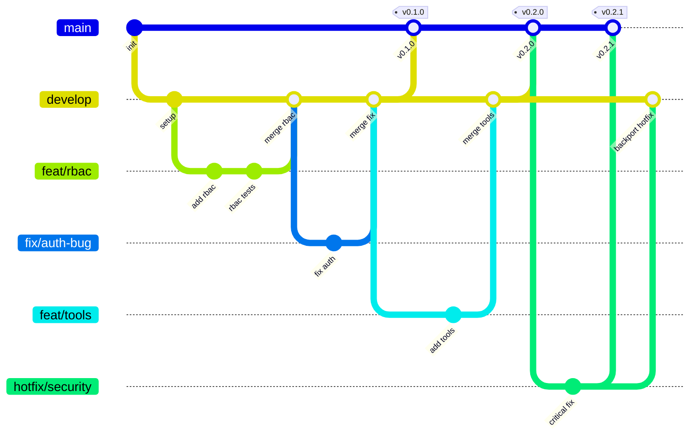

# unified-ui Platform Service

[](https://github.com/unified-ui/unified-ui-platform-service/actions/workflows/ci-tests-and-lint.yml)
[](https://www.python.org/downloads/)
[](LICENSE)
[](https://docs.astral.sh/ruff/)

> **The backbone of your AI management platform** — Centralized authentication, authorization, and core data management for all unified-ui services.

## What is unified-ui?

**unified-ui** transforms the complexity of managing multiple AI systems into a single, cohesive experience. Organizations deploy agents across diverse platforms — Microsoft Foundry, n8n, LangGraph, Copilot, and custom solutions — resulting in fragmented user experiences, inconsistent monitoring, and operational silos.

unified-ui eliminates these challenges by providing **one interface where every agent converges**.

## Role of the Platform Service

The **Platform Service** is the central authority in the unified-ui architecture. It is the **single source of truth** for:

| Responsibility | Description |
|----------------|-------------|
| 🔐 **Authentication** | Validates user identity via 9 identity providers (Entra ID, Google, AWS Cognito, Okta, LDAP, Kerberos, SAML, OIDC, Mock) |
| 🛡️ **Authorization (RBAC)** | Manages tenant memberships, roles, and resource-level permissions |
| 🗄️ **Core Database** | Stores tenants, agents, credentials, conversations, tools, tags, and more |
| 👥 **Identity Management** | Resolves users and groups from identity providers via OBO flow |

### Service Architecture

```
┌─────────────┐     ┌─────────────────────────────────────────────┐
│  Frontend   │────▶│          Platform Service (this)            │
└─────────────┘     │  • Authentication & RBAC                    │
                    │  • Tenants, Agents, Credentials             │
                    │  • Conversations, Tools, Tags               │
                    └──────────────────┬──────────────────────────┘
                                       │
              ┌────────────────────────┼────────────────────────┐
              ▼                        ▼                        ▼
     ┌────────────────┐    ┌────────────────┐    ┌────────────────┐
     │ Agent Service  │    │ ReACT Agent    │    │ Future Service │
     │  (Go/Gin)      │    │ Service (Py)   │    │                │
     └────────────────┘    └────────────────┘    └────────────────┘
              │
              │ Calls Platform Service for:
              │ • User/Token validation
              │ • Config & credential retrieval
              │ • Permission checks
              ▼
     ┌────────────────┐
     │ AI Backends    │
     │ N8N, Foundry,  │
     │ LangGraph, ... │
     └────────────────┘
```

**Key Principle**: Only the Platform Service writes to the core database and manages authentication. All other services delegate auth and core data access to this service.

---

## Tech Stack

| Category | Technology |
|----------|------------|
| **Framework** | FastAPI |
| **Language** | Python 3.13+ |
| **Package Manager** | [uv](https://docs.astral.sh/uv/) |
| **Database** | PostgreSQL (SQLAlchemy + Alembic) |
| **Document DB** | MongoDB / Azure Cosmos DB |
| **Caching** | Redis |
| **Secrets** | Azure Key Vault / HashiCorp Vault / dotenv |
| **Identity** | Microsoft Entra ID, Google, AWS Cognito, Okta, LDAP, Kerberos, SAML, OIDC |
| **Testing** | pytest + pytest-cov + pytest-xdist |
| **Linting** | Ruff |
| **Type Checking** | mypy |

---

## Getting Started

### Prerequisites

- Python 3.13+
- [uv](https://docs.astral.sh/uv/) (recommended)
- Docker & Docker Compose
- PostgreSQL
- Redis

### Installation

```bash
# Clone the repository
git clone https://github.com/unified-ui/unified-ui-platform-service.git
cd unified-ui-platform-service

# Install uv (recommended)
curl -LsSf https://astral.sh/uv/install.sh | sh

# Install dependencies
uv sync

# Install pre-commit hooks
pre-commit install
pre-commit install --hook-type commit-msg

# Start infrastructure (PostgreSQL, Redis, Vault, MongoDB)
docker compose -f docker/local/infra/docker-compose.yml up -d

# Run database migrations
alembic upgrade head

# Start the server
uv run uvicorn unifiedui.app:app --reload
```

The API is available at `http://localhost:8000`

### Common Commands

| Command | Description |
|---------|-------------|
| `uv run uvicorn unifiedui.app:app --reload` | Start dev server |
| `pytest tests/ -n auto --no-header -q` | Run tests in parallel |
| `pytest tests/ -n auto --cov=unifiedui --cov-fail-under=80` | Tests + coverage |
| `ruff check .` | Lint |
| `ruff format .` | Format |
| `mypy unifiedui/` | Type check |
| `alembic upgrade head` | Apply migrations |
| `alembic revision --autogenerate -m "msg"` | Create migration |
| `pre-commit run --all-files` | Run all pre-commit hooks |

> **See [TOOLING.md](TOOLING.md)** for the full tooling guide, pre-commit hooks, and CI details.

---

## API Overview

All resource endpoints are tenant-scoped: `/api/v1/tenants/{tenant_id}/...`

### Core Endpoints

| Resource | Description |
|----------|-------------|
| **Tenants** | CRUD + member management |
| **Organizations** | Multi-tenant organization management |
| **Chat Agents** | Chat agent configurations with permissions |
| **Autonomous Agents** | Background agent registry |
| **Credentials** | Secure credential storage (vault-backed) |
| **Conversations** | Chat session management |
| **Tools** | Tool configurations (OpenAPI, MCP) |
| **Tags** | Tagging system for resources |
| **Chat Widgets** | Custom UI widget definitions |
| **Custom Groups** | Internal permission groups |
| **Tenant AI Models** | AI model configurations per tenant |
| **Principals** | User/group principal management |
| **Identity** | User info, groups, provider data |
| **Dashboard** | Resource statistics |
| **Search** | Global search across all resources |
| **Recent Visits** | User activity tracking |
| **User Favorites** | User bookmark management |

### Documentation

- **Swagger UI**: `http://localhost:8000/docs`
- **ReDoc**: `http://localhost:8000/redoc`

---

## Project Structure

```
unified-ui-platform-service/
├── unifiedui/                   # Main application package
│   ├── app.py                   # FastAPI entry point
│   ├── logger.py                # Centralized logging
│   ├── apis/v1/                 # Route definitions (thin wrappers, no logic)
│   ├── handlers/                # Business logic
│   │   ├── dependencies/        # FastAPI dependency injection
│   │   └── validators/          # Config validators
│   ├── schema/                  # Pydantic schemas
│   │   ├── requests/            # Request models
│   │   └── responses/           # Response models
│   ├── core/                    # Interfaces & base classes
│   │   ├── database/            # SQLAlchemy models, enums, config
│   │   ├── vault/               # Vault interface (ABC)
│   │   ├── caching/             # Cache interface (ABC)
│   │   ├── identity/            # Identity provider interface
│   │   ├── docdatabase/         # Document DB interface
│   │   └── middleware/          # Auth middleware & decorators
│   ├── caching/                 # Redis implementation
│   ├── vault/                   # Azure Key Vault / HashiCorp / dotenv
│   ├── identity/                # 9 identity provider implementations
│   ├── docdatabase/             # MongoDB / Cosmos DB implementation
│   ├── exc/                     # Custom exceptions (typed)
│   ├── services/                # External service clients
│   ├── libs/                    # Third-party client wrappers
│   └── utils/                   # Utilities
├── tests/                       # Test suite (1900+ tests)
│   ├── fixtures/                # Shared test fixtures
│   └── unit/                    # Unit tests (CRUD + RBAC + caching per resource)
├── alembic/                     # Database migrations
├── docker/                      # Docker configs (local + production)
├── docs/                        # Documentation & ADRs
└── .github/                     # CI workflows & Copilot instructions
```

---

## Permission Model

### Tenant-Level Roles

| Role | Description |
|------|-------------|
| `READER` | Can access the tenant with minimal permissions |
| `GLOBAL_ADMIN` | Full access to all tenant resources |
| `APPLICATIONS_ADMIN` | Manage all applications |
| `APPLICATIONS_CREATOR` | Can create new applications |
| `CREDENTIALS_ADMIN` | Manage all credentials |
| `CREDENTIALS_CREATOR` | Can create new credentials |
| `CONVERSATIONS_ADMIN` | Manage all conversations |
| `CONVERSATIONS_CREATOR` | Can create new conversations |
| `AUTONOMOUS_AGENTS_ADMIN` | Manage all autonomous agents |
| `AUTONOMOUS_AGENTS_CREATOR` | Can create new autonomous agents |

### Resource-Level Permissions

| Permission | Description |
|------------|-------------|
| `READ` | View / use resource |
| `WRITE` | Modify resource |
| `ADMIN` | Full control + manage permissions |

**Hierarchy**: `ADMIN` > `WRITE` > `READ`

---

## Branching Strategy

This project follows a **Simplified Flow** branching model — the same strategy used across all unified-ui repositories.



### Branch Types

| Branch | Purpose | Branches from | Merges into |
|--------|---------|---------------|-------------|
| `main` | Production-ready releases | — | — |
| `develop` | Integration branch for features and fixes | `main` | `main` |
| `feat/<name>` | New features or enhancements | `develop` | `develop` |
| `fix/<name>` | Bug fixes (non-critical) | `develop` | `develop` |
| `hotfix/<name>` | Critical production fixes | `main` | `main` + `develop` |
| `docs/<name>` | Documentation-only changes | `develop` | `develop` |
| `refactor/<name>` | Code restructuring without behavior changes | `develop` | `develop` |

### Workflow

1. **Feature/Fix development** — Create a `feat/` or `fix/` branch from `develop`. Open a PR back into `develop`.
2. **Release** — When ready, open a PR from `develop` to `main`. On merge, tag with version.
3. **Hotfixes** — For critical bugs, create a `hotfix/` branch from `main`, fix, and PR to `main`. Then backport to `develop`.

### Rules

- **Never commit directly** to `main` or `develop` — always use PRs
- **All PRs require** passing CI (tests, lint, type check, coverage ≥ 80%)
- **Squash merge** feature/fix branches into `develop` for a clean history
- **Branch naming**: `<type>/<short-description>` (e.g. `feat/chat-agents`, `fix/auth-timeout`)

### CI Checks on PRs

| Check | Description |
|-------|-------------|
| **Branch naming** | Validates `<type>/` prefix convention |
| **Branch target** | `develop` → `main` or `hotfix/*` → `main` only |
| **Lint & Format** | Ruff check + format verification |
| **Tests** | Full test suite with coverage ≥ 80% |
| **CodeQL** | Security scanning |
| **Dependency Review** | License & vulnerability check |

---

## Contributing

Contributions are welcome! Please read [CONTRIBUTING.md](CONTRIBUTING.md) for details on our development workflow, code standards, and how to submit pull requests.

---

## Sponsors

If you find this project useful, consider [sponsoring](SPONSORS.md) its development.

---

## License

MIT License — see [LICENSE](LICENSE) for details.
